# Modelo Entidad-Relación

```mermaid
erDiagram
    alumno_estado {
        int4 id PK
        varchar texto
        int4 estado
    }

    alumnos {
        int4 rut PK
        varchar dv
        varchar id_externo
        varchar estado
        varchar nombre1
        varchar nombre2
        varchar apellido1
        varchar apellido2
        varchar alias
        varchar genero
        date fecha_nacimiento
        varchar foto
        varchar email
        varchar direccion
        varchar region
        varchar comuna
        varchar telefono
        int4 anno_ingreso
        varchar tipo_ingreso
        int4 puntaje_ingreso
        varchar pais
    }

    cargos {
        int4 id_cargo PK
        varchar cargo
    }

    conjuntos {
        varchar id_conjunto PK
        varchar nombre
        text descripcion
    }

    departamento {
        int4 id_departamento PK
        varchar departamento
    }

    inscritos_estado {
        int4 id PK
        varchar texto
        int4 estado
    }

    inscritos_estado_final {
        int4 id PK
        varchar texto
        int4 estado
    }

    instituciones {
        int4 id_institucion PK
        varchar nombre
        varchar sigla
    }

    periodos {
        varchar id_periodo UK
        int4 ano PK
        int4 periodo PK
        varchar periodo_texto
        bool activo
    }

    personas {
        int4 rut PK
        varchar dv
        varchar id_externo
        varchar estado
        varchar nombre1
        varchar nombre2
        varchar apellido1
        varchar apellido2
        varchar alias
        varchar genero
        date fecha_nacimiento
        varchar foto
        varchar email
        varchar direccion
        varchar region
        varchar comuna
        varchar telefono
        int4 anno_ingreso
        varchar tipo_ingreso
        int4 puntaje_ingreso
        varchar pais
    }

    personas_tipo_ingreso {
        int4 id PK
        varchar texto
        int4 estado
    }

    profesores {
        int4 rut PK
        varchar dv
        varchar estado
        varchar nombre1
        varchar nombre2
        varchar apellido1
        varchar apellido2
        varchar genero
        date fecha_nacimiento
        varchar email
        varchar direccion
        varchar region
        varchar comuna
        varchar telefono
        int4 anno_ingreso
        varchar pais
    }

    tipo_de_titulo {
        int4 id PK
        varchar texto
        int4 estado
    }

    tipo_estado_situacion {
        int4 id_estado PK
        varchar estado
    }

    tipo_situacion {
        int4 id PK
        varchar texto
        int4 estado
    }

    tipos_horarios_clases {
        int4 id PK
        varchar texto
        int4 estado
    }

    carreras {
        int4 id_carrera PK
        int4 codigo_carrera
        varchar nombre
        int4 id_tipo_titulo FK
        int4 id_estado FK
        int4 id_licenciatura_asociada
        int4 id_institucion FK
        jsonb fuentes
        varchar titulo_masculino
        varchar titulo_femenino
        int4 terminal
    }

    examenes_grados {
        int4 id_examen PK
        varchar titulo
        int4 rut FK
        int4 id_carrera FK
        varchar id_periodo_inicio FK
        varchar id_periodo_fin FK
        timestamp fecha_examen
        varchar cotutela
        varchar profesor_guia
        jsonb comision
        numeric nota_examen
    }

    planes {
        varchar id_plan PK
        varchar nombre
        int4 id_carrera FK
        int4 version
        varchar descripcion
        int4 vigente
        int4 n_semestres
        date fecha_creacion
        int4 aprobacion_automatica
    }

    ramos {
        int4 id_ramo PK
        varchar codigo
        varchar nombre
        varchar name
        int4 sct
        int4 ud
        varchar id_externo
        int4 id_institucion FK
        text comentario
        text requisito
        text equivalencia
        varchar escala
    }

    salas {
        int4 id_sala PK
        varchar nombre
        int4 id_institucion FK
        int4 capacidad
        int4 capacidad_examen
        int4 aforo
        varchar ubicacion
        varchar edificio
        bool hibrida
        bool exclusiva
    }

    avance_curricular {
        int4 rut PK, FK
        float8 avance
        int4 total
        int4 aprobados
        varchar id_plan PK, FK
    }

    carreras_alumnos {
        int4 rut FK
        int4 id_carrera FK
        varchar id_plan FK
        varchar periodo_inicio FK
        varchar periodo_fin FK
        numeric nota_final
        int4 doble_titulacion
        int4 id_estado_carrera FK
        int8 matricula
        int4 resolucion
        date fecha_resolucion
    }

    cursos {
        int4 id_curso PK
        int4 id_ramo FK
        varchar id_periodo FK
        int4 seccion
        varchar tema
        text comentario
        varchar modalidad
        int4 cupo
        int4 id_departamento FK
    }

    cursos_dictados {
        int4 rut FK
        int4 id_curso FK
        int4 id_cargo FK
        varchar tema
        varchar id_periodo FK
        int4 id_ramo FK
    }

    cursos_homologados {
        int4 rut PK, FK
        int4 id_ramo PK, FK
        numeric nota_final
        varchar observaciones
        varchar tema
        varchar id_periodo PK, FK
    }

    cursos_inscritos {
        int4 rut FK
        int4 id_curso FK
        int4 id_ramo FK
        varchar id_periodo FK
        varchar tema
        int4 id_estado_final FK
        int4 id_estado_curso FK
        numeric nota_final
        int4 id_institucion FK
        timestamp fecha_modificacion
    }

    horario {
        int4 id_horario PK
        int4 semana
        int4 dia
        varchar hora_ini
        varchar hora_fin
        int4 id_curso PK, FK
        int4 id_ramo PK, FK
        int4 id_tipo_clase FK
        varchar grupo_horario
        jsonb salas
    }

    integrante {
        int4 id_ramo PK, FK
        int4 id_curso PK, FK
        varchar id_periodo PK, FK
        int4 rut PK, FK
        int4 id_cargo PK, FK
        int4 id_estado FK
        float8 porcentaje
    }

    mallas {
        int4 id_ramo PK, FK
        int4 nivel
        varchar id_plan PK, FK
        varchar id_plan_compuesto PK
        varchar regla
        int4 cantidad
    }

    profesor_curso {
        int4 id_ramo PK, FK
        int4 id_curso PK, FK
        varchar id_periodo FK
        int4 rut PK, FK
        float8 porcentaje_participacion
        int4 id_cargo PK, FK
    }

    situacion {
        int4 id_situacion PK
        int4 rut FK
        date fecha_creacion
        date fecha_ingreso
        int4 nro_resolucion
        varchar id_periodo FK
        int4 id_tipo_situacion FK
        varchar tipo
        int4 id_estado FK
        int4 id_carrera FK
        int4 id_ramo FK
        int4 id_curso FK
        varchar comentario
        varchar comentario_publico
    }

    carreras }o--|| alumno_estado : "references (id_estado)"
    carreras }o--|| instituciones : "references (id_institucion)"
    carreras }o--|| tipo_de_titulo : "references (id_tipo_titulo)"
    examenes_grados }o--|| carreras : "references (id_carrera)"
    examenes_grados }o--|| periodos : "references (id_periodo_fin)"
    examenes_grados }o--|| periodos : "references (id_periodo_inicio)"
    examenes_grados }o--|| alumnos : "references (rut)"
    planes }o--|| carreras : "references (id_carrera)"
    ramos }o--|| instituciones : "references (id_institucion)"
    salas }o--|| instituciones : "references (id_institucion)"
    avance_curricular }o--|| planes : "references (id_plan)"
    avance_curricular }o--|| alumnos : "references (rut)"
    carreras_alumnos }o--|| carreras : "references (id_carrera)"
    carreras_alumnos }o--|| alumno_estado : "references (id_estado_carrera)"
    carreras_alumnos }o--|| planes : "references (id_plan)"
    carreras_alumnos }o--|| periodos : "references (periodo_fin)"
    carreras_alumnos }o--|| periodos : "references (periodo_inicio)"
    carreras_alumnos }o--|| alumnos : "references (rut)"
    cursos }o--|| departamento : "references (id_departamento)"
    cursos }o--|| periodos : "references (id_periodo)"
    cursos }o--|| ramos : "references (id_ramo)"
    cursos_dictados }o--|| cargos : "references (id_cargo)"
    cursos_dictados }o--|| cursos : "references (id_curso)"
    cursos_dictados }o--|| periodos : "references (id_periodo)"
    cursos_dictados }o--|| ramos : "references (id_ramo)"
    cursos_dictados }o--|| profesores : "references (rut)"
    cursos_homologados }o--|| periodos : "references (id_periodo)"
    cursos_homologados }o--|| ramos : "references (id_ramo)"
    cursos_homologados }o--|| alumnos : "references (rut)"
    cursos_inscritos }o--|| cursos : "references (id_curso)"
    cursos_inscritos }o--|| inscritos_estado : "references (id_estado_curso)"
    cursos_inscritos }o--|| inscritos_estado_final : "references (id_estado_final)"
    cursos_inscritos }o--|| instituciones : "references (id_institucion)"
    cursos_inscritos }o--|| periodos : "references (id_periodo)"
    cursos_inscritos }o--|| ramos : "references (id_ramo)"
    cursos_inscritos }o--|| alumnos : "references (rut)"
    horario }o--|| cursos : "references (id_curso)"
    horario }o--|| ramos : "references (id_ramo)"
    horario }o--|| tipos_horarios_clases : "references (id_tipo_clase)"
    integrante }o--|| cargos : "references (id_cargo)"
    integrante }o--|| cursos : "references (id_curso)"
    integrante }o--|| inscritos_estado_final : "references (id_estado)"
    integrante }o--|| periodos : "references (id_periodo)"
    integrante }o--|| ramos : "references (id_ramo)"
    integrante }o--|| personas : "references (rut)"
    mallas }o--|| planes : "references (id_plan)"
    mallas }o--|| ramos : "references (id_ramo)"
    profesor_curso }o--|| cargos : "references (id_cargo)"
    profesor_curso }o--|| cursos : "references (id_curso)"
    profesor_curso }o--|| periodos : "references (id_periodo)"
    profesor_curso }o--|| ramos : "references (id_ramo)"
    profesor_curso }o--|| profesores : "references (rut)"
    situacion }o--|| carreras : "references (id_carrera)"
    situacion }o--|| cursos : "references (id_curso)"
    situacion }o--|| tipo_estado_situacion : "references (id_estado)"
    situacion }o--|| periodos : "references (id_periodo)"
    situacion }o--|| ramos : "references (id_ramo)"
    situacion }o--|| tipo_situacion : "references (id_tipo_situacion)"
    situacion }o--|| alumnos : "references (rut)"
    %%| deviceScaleFactor: 3
```

## Relaciones y Uniones
A continuación se describen las uniones principales entre tablas, incluyendo campos clave y tipo de relación:

- **situacion ↔ alumnos**: INNER JOIN ON situacion.rut = alumnos.rut (clave foránea `rut` en situacion).
- **situacion ↔ periodos**: INNER JOIN ON situacion.id_periodo = periodos.id_periodo (clave foránea `id_periodo`).
- **situacion ↔ tipo_situacion**: INNER JOIN ON situacion.id_tipo_situacion = tipo_situacion.id (clave foránea `id_tipo_situacion`).
- **situacion ↔ tipo_estado_situacion**: INNER JOIN ON situacion.id_estado = tipo_estado_situacion.id_estado.
- **situacion ↔ carreras**: INNER JOIN ON situacion.id_carrera = carreras.id_carrera.
- **situacion ↔ ramos**: INNER JOIN ON situacion.id_ramo = ramos.id_ramo.
- **situacion ↔ cursos**: INNER JOIN ON situacion.id_curso = cursos.id_curso.

- **cursos_inscritos ↔ alumnos**: INNER JOIN ON cursos_inscritos.rut = alumnos.rut.
- **cursos_inscritos ↔ cursos**: INNER JOIN ON cursos_inscritos.id_curso = cursos.id_curso.
- **cursos_inscritos ↔ ramos**: INNER JOIN ON cursos_inscritos.id_ramo = ramos.id_ramo.
- **cursos_inscritos ↔ periodos**: INNER JOIN ON cursos_inscritos.id_periodo = periodos.id_periodo.
- **cursos_inscritos ↔ inscritos_estado**: INNER JOIN ON cursos_inscritos.id_estado_curso = inscritos_estado.id.
- **cursos_inscritos ↔ inscritos_estado_final**: INNER JOIN ON cursos_inscritos.id_estado_final = inscritos_estado_final.id.
- **cursos_inscritos ↔ instituciones**: INNER JOIN ON cursos_inscritos.id_institucion = instituciones.id_institucion.

- **profesor_curso ↔ profesores**: INNER JOIN ON profesor_curso.rut = profesores.rut.
- **profesor_curso ↔ cursos**: INNER JOIN ON profesor_curso.id_curso = cursos.id_curso.
- **profesor_curso ↔ ramos**: INNER JOIN ON profesor_curso.id_ramo = ramos.id_ramo.
- **profesor_curso ↔ periodos**: INNER JOIN ON profesor_curso.id_periodo = periodos.id_periodo.
- **profesor_curso ↔ cargos**: INNER JOIN ON profesor_curso.id_cargo = cargos.id_cargo.

- **integrante ↔ personas**: INNER JOIN ON integrante.rut = personas.rut.
- **integrante ↔ ramos**: INNER JOIN ON integrante.id_ramo = ramos.id_ramo.
- **integrante ↔ cursos**: INNER JOIN ON integrante.id_curso = cursos.id_curso.
- **integrante ↔ periodos**: INNER JOIN ON integrante.id_periodo = periodos.id_periodo.
- **integrante ↔ cargos**: INNER JOIN ON integrante.id_cargo = cargos.id_cargo.
- **integrante ↔ inscritos_estado_final**: INNER JOIN ON integrante.id_estado = inscritos_estado_final.id.

- **malla_alumno ↔ alumnos**: INNER JOIN ON malla_alumno.rut = alumnos.rut.
- **malla_alumno ↔ planes**: INNER JOIN ON malla_alumno.id_plan = planes.id_plan.
- **malla_alumno ↔ periodos**: INNER JOIN ON malla_alumno.id_periodo_inicio/fin = periodos.id_periodo.

- **mallas ↔ ramos**: INNER JOIN ON mallas.id_ramo = ramos.id_ramo.
- **mallas ↔ planes**: INNER JOIN ON mallas.id_plan = planes.id_plan.

- **carreras_alumnos ↔ alumnos**: INNER JOIN ON carreras_alumnos.rut = alumnos.rut.
- **carreras_alumnos ↔ carreras**: INNER JOIN ON carreras_alumnos.id_carrera = carreras.id_carrera.
- **carreras_alumnos ↔ planes**: INNER JOIN ON carreras_alumnos.id_plan = planes.id_plan.
- **carreras_alumnos ↔ periodos**: INNER JOIN ON carreras_alumnos.periodo_inicio/fin = periodos.id_periodo.
- **carreras_alumnos ↔ alumno_estado**: INNER JOIN ON carreras_alumnos.id_estado_carrera = alumno_estado.id.

- **examenes_grados ↔ alumnos**: INNER JOIN ON examenes_grados.rut = alumnos.rut.
- **examenes_grados ↔ carreras**: INNER JOIN ON examenes_grados.id_carrera = carreras.id_carrera.
- **examenes_grados ↔ periodos**: INNER JOIN ON examenes_grados.id_periodo_inicio/fin = periodos.id_periodo.

- **horario ↔ cursos**: INNER JOIN ON horario.id_curso = cursos.id_curso.
- **horario ↔ ramos**: INNER JOIN ON horario.id_ramo = ramos.id_ramo.
- **horario ↔ tipos_horarios_clases**: INNER JOIN ON horario.id_tipo_clase = tipos_horarios_clases.id