# Modelo Entidad-Relación

## Diagrama Entidad-Relación

```mermaid
erDiagram
    %% ENTIDADES PRINCIPALES DE EVALUACIÓN DOCENTE

    EVALUACION_DOCENTE {
        integer id_encuesta PK
        varchar t "Título/Tipo de evaluación"
        text descripcion "Descripción detallada"
    }

    ENCUESTAS {
        integer id PK
        date fecha_ini "Fecha inicio"
        date fecha_fin "Fecha fin"
        integer id_encuesta FK
        varchar periodo FK
        boolean activa
        integer entregas "Número de entregas"
    }

    SECCIONES {
        varchar id PK
        varchar titulo
        varchar descripcion
        boolean sobre_cargos
    }

    PREGUNTAS {
        varchar id PK
        varchar tipo "opciones|parrafo"
        varchar titulo
        varchar feedback
        jsonb dimension
        boolean obligatoria
        boolean acepta_nula
    }

    OPCIONES {
        integer opcion_id PK
        varchar opcion_texto
    }

    %% TABLAS DE RELACIÓN

    ENCUESTA_SECCION {
        integer encuesta_id PK,FK
        varchar seccion_id PK,FK
    }

    SECCION_PREGUNTA {
        integer encuesta_id PK,FK
        varchar seccion_id PK,FK
        varchar pregunta_id PK,FK
    }

    SECCION_CARGO {
        varchar seccion_id PK,FK
        integer id_cargo PK,FK
    }

    ENCUESTAS_CODIGOS {
        integer id_encuesta PK,FK
        integer id_ramo PK,FK
    }

    %% ENTREGAS Y RESPUESTAS

    ENTREGAS {
        integer id PK
        integer id_curso FK
        integer id_ramo FK
        integer id_aplicacion FK
        jsonb caracterizacion
    }

    RESPUESTAS_OPCIONES {
        integer entrega_id FK
        integer categoria_id
        varchar pregunta_id FK
        integer opcion_id FK
    }

    RESPUESTAS_PARRAFO {
        integer entrega_id PK,FK
        integer categoria_id
        varchar pregunta_id PK,FK
        text respuesta
    }

    %% ENTIDADES ACADÉMICAS PRINCIPALES

    PERIODOS {
        varchar id_periodo PK
        varchar nombre
        date fecha_inicio
        date fecha_fin
        boolean activo
    }

    CURSOS {
        integer id_curso PK
        varchar codigo
        varchar nombre
        integer id_ramo FK
        varchar periodo FK
        integer capacidad
    }

    RAMOS {
        integer id_ramo PK
        varchar codigo
        varchar nombre
        varchar sct "Sistema de Créditos Transferibles"
        varchar ud "Unidades Docentes"
        integer id_institucion FK
        text comentario
    }

    CARRERAS {
        integer id_carrera PK
        varchar codigo
        varchar nombre
        integer id_institucion FK
        boolean activa
    }

    %% PERSONAS Y ROLES

    ALUMNOS {
        integer rut PK
        varchar nombres
        varchar apellidos
        varchar email
        date fecha_nacimiento
        varchar telefono
        boolean activo
    }

    PROFESORES {
        integer rut PK
        varchar nombres
        varchar apellidos
        varchar email
        varchar grado_academico
        varchar especialidad
    }

    CARGOS {
        integer id_cargo PK
        varchar cargo
        varchar descripcion
        boolean activo
    }

    %% INSTITUCIONES

    INSTITUCIONES {
        integer id_institucion PK
        varchar nombre
        varchar codigo
        varchar direccion
        varchar telefono
        varchar email
    }

    %% ENTIDADES DE CURSOS INSCRITOS

    CURSOS_INSCRITOS {
        integer rut PK,FK
        integer id_curso PK,FK
        integer id_ramo PK,FK
        varchar id_periodo PK,FK
        integer id_tipo_escuela FK
        integer id_estado_final FK
        integer id_estado_curso FK
        integer id_institucion FK
        varchar nota_final
        varchar tema
        timestamp fecha_modificacion
    }

    %% ENTIDADES DE EVALUACIONES Y NOTAS

    EVALUACIONES {
        integer id_evaluacion PK
        integer id_curso FK
        integer id_ramo FK
        varchar periodo FK
        varchar t "Título/Nombre evaluación"
        varchar categoria
        varchar escala_texto
        date fecha
        varchar formula
    }

    NOTAS {
        integer id_curso PK,FK
        integer id_ramo PK,FK
        integer id_evaluacion PK,FK
        integer rut PK,FK
        varchar periodo FK
        varchar nota
        text comentario
        date fecha
    }

    NOTAS_BINARIO_RD {
        integer id_curso PK,FK
        integer id_ramo PK,FK
        integer rut PK,FK
        varchar periodo FK
        varchar nota "Aprobado/Reprobado"
        date fecha
    }

    NOTAS_CATEGORICAS_IMB {
        integer id_curso PK,FK
        integer id_ramo PK,FK
        integer rut PK,FK
        varchar periodo FK
        varchar nota "Insuficiente/Suficiente/Bueno/MuyBueno"
        date fecha
    }

    NOTAS_CATEGORICAS_RD {
        integer id_curso PK,FK
        integer id_ramo PK,FK
        integer rut PK,FK
        varchar periodo FK
        varchar nota "Reprobado/Suficiente/A-/Aprobado/A+/Distinción"
        date fecha
    }

    NOTAS_NUM_1_7 {
        integer id_curso PK,FK
        integer id_ramo PK,FK
        integer rut PK,FK
        varchar periodo FK
        decimal nota "Nota numérica 1-7"
        date fecha
    }

    NOTAS_NUM_1_10 {
        integer id_curso PK,FK
        integer id_ramo PK,FK
        integer rut PK,FK
        varchar periodo FK
        decimal nota "Nota numérica 1-10"
        date fecha
    }

    NOTAS_PERCENTIL {
        integer id_curso PK,FK
        integer id_ramo PK,FK
        integer rut PK,FK
        varchar periodo FK
        decimal nota "Nota en percentil"
        date fecha
    }

    %% TIPOS

    TIPO_SITUACION {
        integer id PK
        varchar texto
        integer estado
    }

    TIPO_ESTADO_SITUACION {
        integer id_estado PK
        varchar estado_texto
    }

    TIPO_DE_TITULO {
        integer id PK
        varchar texto
        integer estado
    }

    PERSONAS_TIPO_INGRESO {
        integer id PK
        varchar texto
        integer estado
    }

    INSCRITOS_ESTADO {
        integer id PK
        varchar texto
        integer estado
    }

    INSCRITOS_ESTADO_FINAL {
        integer id PK
        varchar texto
        integer estado
    }

    %% RELACIONES PRINCIPALES

    %% Sistema de Encuestas
    EVALUACION_DOCENTE ||--o{ ENCUESTAS : "define"
    ENCUESTAS ||--o{ ENCUESTA_SECCION : "organiza"
    SECCIONES ||--o{ ENCUESTA_SECCION : "pertenece"
    SECCIONES ||--o{ SECCION_PREGUNTA : "contiene"
    PREGUNTAS ||--o{ SECCION_PREGUNTA : "incluye"
    ENCUESTAS ||--o{ SECCION_PREGUNTA : "estructura"
    SECCIONES ||--o{ SECCION_CARGO : "aplica_a"
    CARGOS ||--o{ SECCION_CARGO : "evalua"
    EVALUACION_DOCENTE ||--o{ ENCUESTAS_CODIGOS : "aplica_a"
    RAMOS ||--o{ ENCUESTAS_CODIGOS : "evaluado_en"

    %% Entregas y Respuestas
    ENCUESTAS ||--o{ ENTREGAS : "genera"
    CURSOS ||--o{ ENTREGAS : "recibe"
    RAMOS ||--o{ ENTREGAS : "asociado"
    ENTREGAS ||--o{ RESPUESTAS_OPCIONES : "contiene"
    ENTREGAS ||--o{ RESPUESTAS_PARRAFO : "contiene"
    PREGUNTAS ||--o{ RESPUESTAS_OPCIONES : "responde"
    PREGUNTAS ||--o{ RESPUESTAS_PARRAFO : "responde"
    OPCIONES ||--o{ RESPUESTAS_OPCIONES : "selecciona"
    %% Relaciones Académicas
    PERIODOS ||--o{ ENCUESTAS : "ejecuta_en"
    PERIODOS ||--o{ CURSOS : "programa"
    RAMOS ||--o{ CURSOS : "dicta"
    INSTITUCIONES ||--o{ CARRERAS : "ofrece"
    INSTITUCIONES ||--o{ RAMOS : "administra"

    %% Relaciones de Cursos Inscritos
    ALUMNOS ||--o{ CURSOS_INSCRITOS : "inscribe"
    CURSOS ||--o{ CURSOS_INSCRITOS : "es_inscrito_en"
    RAMOS ||--o{ CURSOS_INSCRITOS : "corresponde_a"
    PERIODOS ||--o{ CURSOS_INSCRITOS : "durante"
    INSTITUCIONES ||--o{ CURSOS_INSCRITOS : "gestiona"
    CURSOS_INSCRITOS ||--|| INSCRITOS_ESTADO : "tiene_estado_curso"
    CURSOS_INSCRITOS ||--|| INSCRITOS_ESTADO_FINAL : "tiene_estado_final"

    %% Relaciones de Evaluaciones y Notas
    CURSOS ||--o{ EVALUACIONES : "tiene"
    RAMOS ||--o{ EVALUACIONES : "asociada_a"
    PERIODOS ||--o{ EVALUACIONES : "realizada_en"
    EVALUACIONES ||--o{ NOTAS : "califica_con"
    NOTAS ||--|| CURSOS : "registra_en"
    NOTAS ||--|| RAMOS : "corresponde_a"
    NOTAS ||--|| ALUMNOS : "obtiene"
    NOTAS ||--|| PERIODOS : "emitida_en"

    %% Relaciones de Tipos de Notas
    ALUMNOS ||--o{ NOTAS_BINARIO_RD : "obtiene"
    ALUMNOS ||--o{ NOTAS_CATEGORICAS_IMB : "obtiene"
    ALUMNOS ||--o{ NOTAS_CATEGORICAS_RD : "obtiene"
    ALUMNOS ||--o{ NOTAS_NUM_1_7 : "obtiene"
    ALUMNOS ||--o{ NOTAS_NUM_1_10 : "obtiene"
    ALUMNOS ||--o{ NOTAS_PERCENTIL : "obtiene"
    CURSOS ||--o{ NOTAS_BINARIO_RD : "evalua_en"
    CURSOS ||--o{ NOTAS_CATEGORICAS_IMB : "evalua_en"
    CURSOS ||--o{ NOTAS_CATEGORICAS_RD : "evalua_en"
    CURSOS ||--o{ NOTAS_NUM_1_7 : "evalua_en"
    CURSOS ||--o{ NOTAS_NUM_1_10 : "evalua_en"
    CURSOS ||--o{ NOTAS_PERCENTIL : "evalua_en"
    RAMOS ||--o{ NOTAS_BINARIO_RD : "asigna"
    RAMOS ||--o{ NOTAS_CATEGORICAS_IMB : "asigna"
    RAMOS ||--o{ NOTAS_CATEGORICAS_RD : "asigna"
    RAMOS ||--o{ NOTAS_NUM_1_7 : "asigna"
    RAMOS ||--o{ NOTAS_NUM_1_10 : "asigna"
    RAMOS ||--o{ NOTAS_PERCENTIL : "asigna"
    PERIODOS ||--o{ NOTAS_BINARIO_RD : "durante"
    PERIODOS ||--o{ NOTAS_CATEGORICAS_IMB : "durante"
    PERIODOS ||--o{ NOTAS_CATEGORICAS_RD : "durante"
    PERIODOS ||--o{ NOTAS_NUM_1_7 : "durante"
    PERIODOS ||--o{ NOTAS_NUM_1_10 : "durante"
    PERIODOS ||--o{ NOTAS_PERCENTIL : "durante"

    %% Relaciones con Tipos
    CARRERAS ||--|| TIPO_DE_TITULO : "otorga"
    ALUMNOS ||--|| PERSONAS_TIPO_INGRESO : "ingresa_por"
    PROFESORES ||--|| PERSONAS_TIPO_INGRESO : "ingresa_por"
```

## Relaciones y Uniones

A continuación se describen las uniones principales entre tablas, incluyendo campos clave y tipo de relación:

- **situacion ↔ alumnos**: INNER JOIN ON situacion.rut = alumnos.rut (clave foránea `rut` en situacion).
- **situacion ↔ periodos**: INNER JOIN ON situacion.id_periodo = periodos.id_periodo (clave foránea `id_periodo`).
- **situacion ↔ tipo_situacion**: INNER JOIN ON situacion.id_tipo_situacion = tipo_situacion.id (clave foránea `id_tipo_situacion`).
- **situacion ↔ tipo_estado_situacion**: INNER JOIN ON situacion.id_estado = tipo_estado_situacion.id_estado.
- **situacion ↔ carreras**: INNER JOIN ON situacion.id_carrera = carreras.id_carrera.
- **situacion ↔ ramos**: INNER JOIN ON situacion.id_ramo = ramos.id_ramo.
- **situacion ↔ cursos**: INNER JOIN ON situacion.id_curso = cursos.id_curso.

- **cursos_inscritos ↔ alumnos**: INNER JOIN ON cursos_inscritos.rut = alumnos.rut.
- **cursos_inscritos ↔ cursos**: INNER JOIN ON cursos_inscritos.id_curso = cursos.id_curso.
- **cursos_inscritos ↔ ramos**: INNER JOIN ON cursos_inscritos.id_ramo = ramos.id_ramo.
- **cursos_inscritos ↔ periodos**: INNER JOIN ON cursos_inscritos.id_periodo = periodos.id_periodo.
- **cursos_inscritos ↔ inscritos_estado**: INNER JOIN ON cursos_inscritos.id_estado_curso = inscritos_estado.id.
- **cursos_inscritos ↔ inscritos_estado_final**: INNER JOIN ON cursos_inscritos.id_estado_final = inscritos_estado_final.id.
- **cursos_inscritos ↔ instituciones**: INNER JOIN ON cursos_inscritos.id_institucion = instituciones.id_institucion.

- **profesor_curso ↔ profesores**: INNER JOIN ON profesor_curso.rut = profesores.rut.
- **profesor_curso ↔ cursos**: INNER JOIN ON profesor_curso.id_curso = cursos.id_curso.
- **profesor_curso ↔ ramos**: INNER JOIN ON profesor_curso.id_ramo = ramos.id_ramo.
- **profesor_curso ↔ periodos**: INNER JOIN ON profesor_curso.id_periodo = periodos.id_periodo.
- **profesor_curso ↔ cargos**: INNER JOIN ON profesor_curso.id_cargo = cargos.id_cargo.

- **integrante ↔ personas**: INNER JOIN ON integrante.rut = personas.rut.
- **integrante ↔ ramos**: INNER JOIN ON integrante.id_ramo = ramos.id_ramo.
- **integrante ↔ cursos**: INNER JOIN ON integrante.id_curso = cursos.id_curso.
- **integrante ↔ periodos**: INNER JOIN ON integrante.id_periodo = periodos.id_periodo.
- **integrante ↔ cargos**: INNER JOIN ON integrante.id_cargo = cargos.id_cargo.
- **integrante ↔ inscritos_estado_final**: INNER JOIN ON integrante.id_estado = inscritos_estado_final.id.

- **malla_alumno ↔ alumnos**: INNER JOIN ON malla_alumno.rut = alumnos.rut.
- **malla_alumno ↔ planes**: INNER JOIN ON malla_alumno.id_plan = planes.id_plan.
- **malla_alumno ↔ periodos**: INNER JOIN ON malla_alumno.id_periodo_inicio/fin = periodos.id_periodo.

- **mallas ↔ ramos**: INNER JOIN ON mallas.id_ramo = ramos.id_ramo.
- **mallas ↔ planes**: INNER JOIN ON mallas.id_plan = planes.id_plan.

- **carreras_alumnos ↔ alumnos**: INNER JOIN ON carreras_alumnos.rut = alumnos.rut.
- **carreras_alumnos ↔ carreras**: INNER JOIN ON carreras_alumnos.id_carrera = carreras.id_carrera.
- **carreras_alumnos ↔ planes**: INNER JOIN ON carreras_alumnos.id_plan = planes.id_plan.
- **carreras_alumnos ↔ periodos**: INNER JOIN ON carreras_alumnos.periodo_inicio/fin = periodos.id_periodo.
- **carreras_alumnos ↔ alumno_estado**: INNER JOIN ON carreras_alumnos.id_estado_carrera = alumno_estado.id.

- **examenes_grados ↔ alumnos**: INNER JOIN ON examenes_grados.rut = alumnos.rut.
- **examenes_grados ↔ carreras**: INNER JOIN ON examenes_grados.id_carrera = carreras.id_carrera.
- **examenes_grados ↔ periodos**: INNER JOIN ON examenes_grados.id_periodo_inicio/fin = periodos.id_periodo.

- **horario ↔ cursos**: INNER JOIN ON horario.id_curso = cursos.id_curso.
- **horario ↔ ramos**: INNER JOIN ON horario.id_ramo = ramos.id_ramo.
- **horario ↔ tipos_horarios_clases**: INNER JOIN ON horario.id_tipo_clase = tipos_horarios_clases.id.

### Relaciones del Sistema de Encuestas

- **evaluacion_docente ↔ encuestas**: INNER JOIN ON evaluacion_docente.id_encuesta = encuestas.id_encuesta.
- **encuestas ↔ periodos**: INNER JOIN ON encuestas.periodo = periodos.id_periodo.
- **encuestas ↔ entregas**: INNER JOIN ON encuestas.id = entregas.id_aplicacion.

- **encuesta_seccion ↔ encuestas**: INNER JOIN ON encuesta_seccion.encuesta_id = encuestas.id.
- **encuesta_seccion ↔ secciones**: INNER JOIN ON encuesta_seccion.seccion_id = secciones.id.

- **seccion_pregunta ↔ encuestas**: INNER JOIN ON seccion_pregunta.encuesta_id = encuestas.id.
- **seccion_pregunta ↔ secciones**: INNER JOIN ON seccion_pregunta.seccion_id = secciones.id.
- **seccion_pregunta ↔ preguntas**: INNER JOIN ON seccion_pregunta.pregunta_id = preguntas.id.

- **seccion_cargo ↔ secciones**: INNER JOIN ON seccion_cargo.seccion_id = secciones.id.
- **seccion_cargo ↔ cargos**: INNER JOIN ON seccion_cargo.id_cargo = cargos.id_cargo.

- **encuestas_codigos ↔ evaluacion_docente**: INNER JOIN ON encuestas_codigos.id_encuesta = evaluacion_docente.id_encuesta.
- **encuestas_codigos ↔ ramos**: INNER JOIN ON encuestas_codigos.id_ramo = ramos.id_ramo.

- **entregas ↔ cursos**: INNER JOIN ON entregas.id_curso = cursos.id_curso.
- **entregas ↔ ramos**: INNER JOIN ON entregas.id_ramo = ramos.id_ramo.
- **entregas ↔ encuestas**: INNER JOIN ON entregas.id_aplicacion = encuestas.id.

- **respuestas_opciones ↔ entregas**: INNER JOIN ON respuestas_opciones.entrega_id = entregas.id.
- **respuestas_opciones ↔ preguntas**: INNER JOIN ON respuestas_opciones.pregunta_id = preguntas.id.
- **respuestas_opciones ↔ opciones**: INNER JOIN ON respuestas_opciones.opcion_id = opciones.opcion_id.

- **respuestas_parrafo ↔ entregas**: INNER JOIN ON respuestas_parrafo.entrega_id = entregas.id.
- **respuestas_parrafo ↔ preguntas**: INNER JOIN ON respuestas_parrafo.pregunta_id = preguntas.id.

### Relaciones de Control Académico Adicionales

- **avance_curricular ↔ alumnos**: INNER JOIN ON avance_curricular.rut = alumnos.rut.
- **avance_curricular ↔ planes**: INNER JOIN ON avance_curricular.id_plan = planes.id_plan.

- **avance_curricular_por_periodo ↔ alumnos**: INNER JOIN ON avance_curricular_por_periodo.rut = alumnos.rut.
- **avance_curricular_por_periodo ↔ planes**: INNER JOIN ON avance_curricular_por_periodo.id_plan = planes.id_plan.
- **avance_curricular_por_periodo ↔ periodos**: INNER JOIN ON avance_curricular_por_periodo.periodo = periodos.id_periodo.

- **alumno_estado ↔ alumnos**: INNER JOIN ON alumno_estado.rut = alumnos.rut.
- **alumno_estado ↔ tipos_estado**: INNER JOIN ON alumno_estado.id_tipo_estado = tipos_estado.id.
- **alumno_estado ↔ periodos**: INNER JOIN ON alumno_estado.periodo = periodos.id_periodo.

### Relaciones de Asistencia y Eventos

- **evento ↔ cursos**: INNER JOIN ON evento.id_curso = cursos.id_curso.
- **evento ↔ periodos**: INNER JOIN ON evento.periodo = periodos.id_periodo.

- **asistencia_cursos ↔ cursos**: INNER JOIN ON asistencia_cursos.id_curso = cursos.id_curso.
- **asistencia_cursos ↔ periodos**: INNER JOIN ON asistencia_cursos.periodo = periodos.id_periodo.
- **asistencia_cursos ↔ alumnos**: INNER JOIN ON asistencia_cursos.rut = alumnos.rut.
- **asistencia_cursos ↔ tipo_asistencia**: INNER JOIN ON asistencia_cursos.id_asistencia = tipo_asistencia.id_asistencia.
- **asistencia_cursos ↔ evento**: INNER JOIN ON asistencia_cursos.id_evento = evento.id_evento.

### Relaciones de Infraestructura

- **salas ↔ instituciones**: INNER JOIN ON salas.id_institucion = instituciones.id_institucion.
- **departamento ↔ instituciones**: INNER JOIN ON departamento.id_institucion = instituciones.id_institucion.

### Relaciones de Homologación

- **cursos_homologados ↔ alumnos**: INNER JOIN ON cursos_homologados.rut = alumnos.rut.
- **cursos_homologados ↔ ramos**: INNER JOIN ON cursos_homologados.id_ramo = ramos.id_ramo.
- **cursos_homologados ↔ periodos**: INNER JOIN ON cursos_homologados.id_periodo = periodos.id_periodo.

### Relaciones Jerárquicas Institucionales

- **carreras ↔ instituciones**: INNER JOIN ON carreras.id_institucion = instituciones.id_institucion.
- **ramos ↔ instituciones**: INNER JOIN ON ramos.id_institucion = instituciones.id_institucion.
- **planes ↔ carreras**: INNER JOIN ON planes.id_carrera = carreras.id_carrera.
- **cursos ↔ periodos**: INNER JOIN ON cursos.periodo = periodos.id_periodo.
- **cursos ↔ ramos**: INNER JOIN ON cursos.id_ramo = ramos.id_ramo.

### Relaciones Adicionales de Personas

- **profesores ↔ departamento**: INNER JOIN ON profesores.id_departamento = departamento.id_departamento (si existe este campo).
- **alumnos ↔ situacion**: INNER JOIN ON alumnos.rut = situacion.rut.

### Relaciones de Notas y Evaluaciones

- **notas ↔ [`cursos`](dbt-etl/dbt_ury/models/ucampus/features/cursos/cursos.yml)**: INNER JOIN ON `notas.id_curso` = `cursos.id_curso`.
- **notas ↔ [`ramos`](dbt-etl/dbt_ury/models/ucampus/features/ramos/ramos.yml)**: INNER JOIN ON `notas.id_ramo` = `ramos.id_ramo`.
- **notas ↔ [`evaluaciones`](dbt-etl/dbt_ury/models/ucampus/features/notas/evaluaciones.yml)**: INNER JOIN ON `notas.id_evaluacion` = `evaluaciones.id_evaluacion`.
- **notas ↔ [`alumnos`](dbt-etl/dbt_ury/models/ucampus/features/personas/alumnos.yml)**: INNER JOIN ON `notas.rut` = `alumnos.rut`.
- **notas ↔ [`periodos`](dbt-etl/dbt_ury/models/ucampus/features/periodos/periodos.yml)**: INNER JOIN ON `notas.periodo` = `periodos.id_periodo`.
- **[`evaluaciones`](dbt-etl/dbt_ury/models/ucampus/features/notas/evaluaciones.yml) ↔ [`cursos`](dbt-etl/dbt_ury/models/ucampus/features/cursos/cursos.yml)**: INNER JOIN ON `evaluaciones.id_curso` = `cursos.id_curso`.
- **[`evaluaciones`](dbt-etl/dbt_ury/models/ucampus/features/notas/evaluaciones.yml) ↔ [`ramos`](dbt-etl/dbt_ury/models/ucampus/features/ramos/ramos.yml)**: INNER JOIN ON `evaluaciones.id_ramo` = `ramos.id_ramo`.
- **[`evaluaciones`](dbt-etl/dbt_ury/models/ucampus/features/notas/evaluaciones.yml) ↔ [`periodos`](dbt-etl/dbt_ury/models/ucampus/features/periodos/periodos.yml)**: INNER JOIN ON `evaluaciones.periodo` = `periodos.id_periodo`.

### Relaciones de Tipos de Notas Específicas

- **notas_binario_rd ↔ [`alumnos`](dbt-etl/dbt_ury/models/ucampus/features/personas/alumnos.yml)**: INNER JOIN ON `notas_binario_rd.rut` = `alumnos.rut`.
- **notas_binario_rd ↔ [`cursos`](dbt-etl/dbt_ury/models/ucampus/features/cursos/cursos.yml)**: INNER JOIN ON `notas_binario_rd.id_curso` = `cursos.id_curso`.
- **notas_binario_rd ↔ [`ramos`](dbt-etl/dbt_ury/models/ucampus/features/ramos/ramos.yml)**: INNER JOIN ON `notas_binario_rd.id_ramo` = `ramos.id_ramo`.
- **notas_binario_rd ↔ [`periodos`](dbt-etl/dbt_ury/models/ucampus/features/periodos/periodos.yml)**: INNER JOIN ON `notas_binario_rd.periodo` = `periodos.id_periodo`.

- **notas_categoricas_imb ↔ [`alumnos`](dbt-etl/dbt_ury/models/ucampus/features/personas/alumnos.yml)**: INNER JOIN ON `notas_categoricas_imb.rut` = `alumnos.rut`.
- **notas_categoricas_imb ↔ [`cursos`](dbt-etl/dbt_ury/models/ucampus/features/cursos/cursos.yml)**: INNER JOIN ON `notas_categoricas_imb.id_curso` = `cursos.id_curso`.
- **notas_categoricas_imb ↔ [`ramos`](dbt-etl/dbt_ury/models/ucampus/features/ramos/ramos.yml)**: INNER JOIN ON `notas_categoricas_imb.id_ramo` = `ramos.id_ramo`.
- **notas_categoricas_imb ↔ [`periodos`](dbt-etl/dbt_ury/models/ucampus/features/periodos/periodos.yml)**: INNER JOIN ON `notas_categoricas_imb.periodo` = `periodos.id_periodo`.

- **notas_categoricas_rd ↔ [`alumnos`](dbt-etl/dbt_ury/models/ucampus/features/personas/alumnos.yml)**: INNER JOIN ON `notas_categoricas_rd.rut` = `alumnos.rut`.
- **notas_categoricas_rd ↔ [`cursos`](dbt-etl/dbt_ury/models/ucampus/features/cursos/cursos.yml)**: INNER JOIN ON `notas_categoricas_rd.id_curso` = `cursos.id_curso`.
- **notas_categoricas_rd ↔ [`ramos`](dbt-etl/dbt_ury/models/ucampus/features/ramos/ramos.yml)**: INNER JOIN ON `notas_categoricas_rd.id_ramo` = `ramos.id_ramo`.
- **notas_categoricas_rd ↔ [`periodos`](dbt-etl/dbt_ury/models/ucampus/features/periodos/periodos.yml)**: INNER JOIN ON `notas_categoricas_rd.periodo` = `periodos.id_periodo`.

- **notas_num_1_7 ↔ [`alumnos`](dbt-etl/dbt_ury/models/ucampus/features/personas/alumnos.yml)**: INNER JOIN ON `notas_num_1_7.rut` = `alumnos.rut`.
- **notas_num_1_7 ↔ [`cursos`](dbt-etl/dbt_ury/models/ucampus/features/cursos/cursos.yml)**: INNER JOIN ON `notas_num_1_7.id_curso` = `cursos.id_curso`.
- **notas_num_1_7 ↔ [`ramos`](dbt-etl/dbt_ury/models/ucampus/features/ramos/ramos.yml)**: INNER JOIN ON `notas_num_1_7.id_ramo` = `ramos.id_ramo`.
- **notas_num_1_7 ↔ [`periodos`](dbt-etl/dbt_ury/models/ucampus/features/periodos/periodos.yml)**: INNER JOIN ON `notas_num_1_7.periodo` = `periodos.id_periodo`.

- **notas_num_1_10 ↔ [`alumnos`](dbt-etl/dbt_ury/models/ucampus/features/personas/alumnos.yml)**: INNER JOIN ON `notas_num_1_10.rut` = `alumnos.rut`.
- **notas_num_1_10 ↔ [`cursos`](dbt-etl/dbt_ury/models/ucampus/features/cursos/cursos.yml)**: INNER JOIN ON `notas_num_1_10.id_curso` = `cursos.id_curso`.
- **notas_num_1_10 ↔ [`ramos`](dbt-etl/dbt_ury/models/ucampus/features/ramos/ramos.yml)**: INNER JOIN ON `notas_num_1_10.id_ramo` = `ramos.id_ramo`.
- **notas_num_1_10 ↔ [`periodos`](dbt-etl/dbt_ury/models/ucampus/features/periodos/periodos.yml)**: INNER JOIN ON `notas_num_1_10.periodo` = `periodos.id_periodo`.

- **notas_percentil ↔ [`alumnos`](dbt-etl/dbt_ury/models/ucampus/features/personas/alumnos.yml)**: INNER JOIN ON `notas_percentil.rut` = `alumnos.rut`.
- **notas_percentil ↔ [`cursos`](dbt-etl/dbt_ury/models/ucampus/features/cursos/cursos.yml)**: INNER JOIN ON `notas_percentil.id_curso` = `cursos.id_curso`.
- **notas_percentil ↔ [`ramos`](dbt-etl/dbt_ury/models/ucampus/features/ramos/ramos.yml)**: INNER JOIN ON `notas_percentil.id_ramo` = `ramos.id_ramo`.
- **notas_percentil ↔ [`periodos`](dbt-etl/dbt_ury/models/ucampus/features/periodos/periodos.yml)**: INNER JOIN ON `notas_percentil.periodo` = `periodos.id_periodo`.

### Relaciones con Tablas de Tipos Específicos

- **[`carreras`](dbt-etl/dbt_ury/models/ucampus/features/carreras/carreras.yml) ↔ [`tipo_de_titulo`](dbt-etl/dbt_ury/models/ucampus/features/tipos_estado/tipo_de_titulo.yml)**: INNER JOIN ON `carreras.id_tipo_titulo` = `tipo_de_titulo.id`.
- **[`alumnos`](dbt-etl/dbt_ury/models/ucampus/features/personas/alumnos.yml) ↔ [`personas_tipo_ingreso`](dbt-etl/dbt_ury/models/ucampus/features/tipos_estado/personas_tipo_ingreso.yml)**: INNER JOIN ON `alumnos.tipo_ingreso` = `personas_tipo_ingreso.id`.
- **[`profesores`](dbt-etl/dbt_ury/models/ucampus/features/personas/profesores.yml) ↔ [`personas_tipo_ingreso`](dbt-etl/dbt_ury/models/ucampus/features/tipos_estado/personas_tipo_ingreso.yml)**: INNER JOIN ON `profesores.tipo_ingreso` = `personas_tipo_ingreso.id`.
